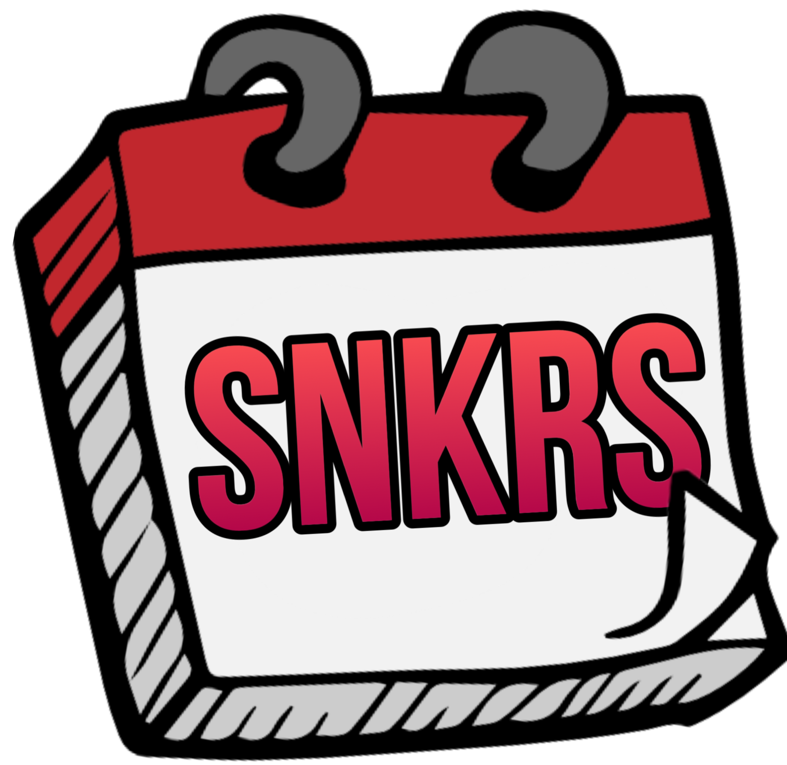

[![Contributors][contributors-shield]][contributors-url]
[![Forks][forks-shield]][forks-url]
[![Stargazers][stars-shield]][stars-url]
[![Issues][issues-shield]][issues-url]
[![MIT License][license-shield]][license-url]

<!-- PROJECT LOGO -->
 

  

  <h3 align="center">SneakerSchedule</h3>

  

    Disciplina de Desenvolvimento mobile - IONIC
     
    <a href="https://github.com/oliveeiralucas/SneakerSchedule"><strong>Explorar Documentos »</strong></a>
     
     
    <a href="https://github.com/oliveeiralucas/SneakerSchedule">View Demo</a>
    ·
    <a href="https://github.com/oliveeiralucas/SneakerSchedule/issues">Report Bug</a>
    ·
    <a href="https://github.com/oliveeiralucas/SneakerSchedule/issues">Request Feature</a>
  

<!-- ABOUT THE PROJECT -->
## Sobre o Projeto
Bem-vindo ao *Sneakers Schedule* - um aplicativo móvel incrível baseado em Ionic.

Nosso aplicativo é focado na comunidade de sneakerheads e entusiastas de moda. Ele permite que os usuários acessem pré-vendas de tênis exclusivos e também oferece uma experiência social emocionante. Os recursos-chave incluem:

- Listagem de Pré-Vendas: Explore uma lista completa de pré-vendas de sneakers, mantendo-se atualizado com os lançamentos mais recentes.

- Favoritar e Adicionar ao Carrinho: Os usuários podem marcar seus lançamentos favoritos e até mesmo adicionar itens ao carrinho de compras para uma experiência de compra mais fácil.

- Interação Social: Conecte-se com outros entusiastas de tênis, compartilhe suas escolhas e descubra o que está em alta na comunidade.

### Protótipo

[![Protótipo][https://github.com/oliveeiralucas/SneakerSchedule/blob/main/SneakerSchedule-Prototype.pdf]]

(<a href="#readme-top">Voltar ao Topo</a>)

### Tecnologias Utilizadas

Para a construção desse projeto utilizamos as seguintes tecnologias:

* IONIC
* JavaScript
* HTML
* CSS

(<a href="#readme-top">Voltar ao Topo</a>)

<!-- ROADMAP -->
## Lista de Tarefas

- [x] Criar Repositório
- [x] Criar Protótipo
- [ ] Programar Protótipo Inicial (HTML/CSS/JS)
- [ ] Passar Para IONIC Framework
- [ ] Multi Linguagem
    - [ ] Portugues
    - [ ] Ingles
- [ ] Carrinho
- [ ] Deploy

Veja as [open issues](https://github.com/oliveeiralucas/SneakerSchedule/issues) para uma lista completa de funcionalidades propostas (e problemas conhecidos).

(<a href="#readme-top">Voltar ao Topo</a>)

<!-- CONTRIBUTING -->
## Contribuição

As contribuições são o que tornam a comunidade de código aberto um lugar incrível para aprender, inspirar e criar. Qualquer contribuição que você fizer é altamente apreciada.

Se você tiver uma sugestão que possa melhorar isso, por favor, faça um fork do repositório e crie uma solicitação de pull. Você também pode simplesmente abrir um problema com a tag "melhoria".

Não se esqueça de dar uma estrela ao projeto!

1. Faça um fork do projeto.
2. Crie sua ramificação de recurso (git checkout -b feature/NovoRecursoIncrivel).
3. Faça seus commits (git commit -m 'Adicionar um recurso incrível').
4. Faça o push para a ramificação (git push origin feature/NovoRecursoIncrivel).
5. Abra uma solicitação de pull."

(<a href="#readme-top">Voltar ao Topo</a>)

<!-- LICENÇA -->
## Licença

Distribuído sob a Licença MIT. Consulte LICENSE.txt para mais informações.

(<a href="#readme-top">Voltar ao Topo</a>)

<!-- CONTATO -->
## Contato

 - Lucas Waidman de Oliveira - lucas.oliveira@edu.unifil.br
 - Davi Giovani - davigiovani@edu.unifil.br
 - Lucas Rezende - lucas.rezende@edu.unifil.br

(<a href="#readme-top">Voltar ao Topo</a>)

<!-- AGRADECIMENTOS -->
## Agradecimentos

Agradecemos ao Professor Petri por ter nos dados essa matéria com tanta excelência e dedicação

(<a href="#readme-top">Voltar ao Topo</a>)

<!-- MARKDOWN LINKS & IMAGES -->
<!-- https://www.markdownguide.org/basic-syntax/#reference-style-links -->
[contributors-shield]: https://img.shields.io/github/contributors/oliveeiralucas/SneakerSchedule.svg?style=for-the-badge
[contributors-url]: https://github.com/oliveeiralucas/SneakerSchedule/graphs/contributors
[forks-shield]: https://img.shields.io/github/forks/oliveeiralucas/SneakerSchedule.svg?style=for-the-badge
[forks-url]: https://github.com/oliveeiralucas/SneakerSchedule/network/members
[stars-shield]: https://img.shields.io/github/stars/oliveeiralucas/SneakerSchedule.svg?style=for-the-badge
[stars-url]: https://github.com/oliveeiralucas/SneakerSchedule/stargazers
[issues-shield]: https://img.shields.io/github/issues/oliveeiralucas/SneakerSchedule.svg?style=for-the-badge
[issues-url]: https://github.com/oliveeiralucas/SneakerSchedule/issues
[license-shield]: https://img.shields.io/github/license/oliveeiralucas/SneakerSchedule.svg?style=for-the-badge
[license-url]: https://github.com/oliveeiralucas/SneakerSchedule/blob/master/LICENSE.txt

[Ionic]: https://img.shields.io/badge/Ionic-20232A?style=for-the-badge&logo=ionic&logoColor=3880FF
[JavaScript]: https://img.shields.io/badge/JavaScript-20232A?style=for-the-badge&logo=javascript&logoColor=F7DF1E
[CSS]: https://img.shields.io/badge/CSS-20232A?style=for-the-badge&logo=css3&logoColor=1572B6
[HTML]: https://img.shields.io/badge/HTML-20232A?style=for-the-badge&logo=html5&logoColor=E34F26
[HTML License]: https://github.com/oliveeiralucas/SneakerSchedule/blob/master/LICENSE.txt

